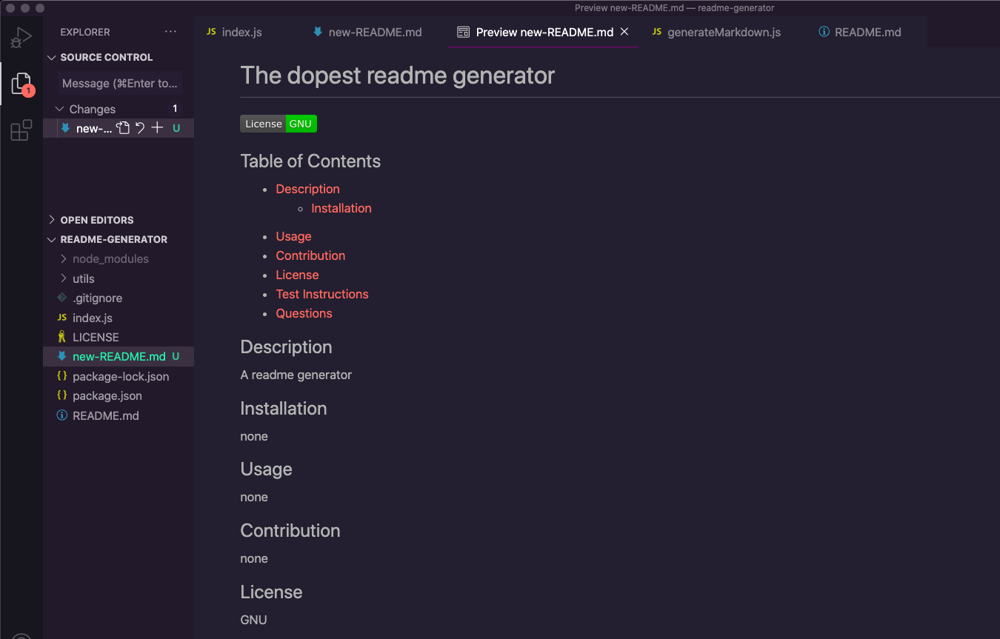

# README Generator

[](https://opensource.org/licenses/MIT)
[](https://www.linkedin.com/in/maranda-zwieschowski/)

<br />
<p align="center">
  <h3 align="center">Readme Generator</h3>

  <p align="center">
    A README generator geared at making a standardized, high quality format.
    <br />
    <a href="https://github.com/marandaz/readme-generator"><strong>Explore the docs »</strong></a>
    <br />
    <br />
    <a href="https://github.com/marandaz/readme-generator">View Demo</a>
    ·
    <a href="https://github.com/marandaz/readme-generator/issues">Report Bug</a>
    ·
    <a href="https://github.com/marandaz/readme-generator/issues">Request Feature</a>
  </p>
</p>


## Table of Contents

* [About the Project](#about-the-project) 
* [Installation](#installation)
* [Usage](#usage)
* [Roadmap](#roadmap)
* [Contributing](#contributing)
* [License](#license)
* [Contact](#contact)
* [Acknowledgements](#acknowledgements)


## About The Project

The Readme Generator is geared towards making devopment easier for the contributing dev while concurrently creating a standardized format for future repositories or projects. This is a command-line application that dynamicaklly generates a README.md file from user input using inquirer. 


## Installation

For this project you will need to install inquirer by inputing npm i inquirer

1. Clone the repo
```sh
git clone https://github.com/marandaz/readme-generator.git
```
2. Install NPM packages
```sh
npm install
```


## Usage

The project uses inquirer and fs to create a standardized readme.  To use this, you will need to use node.js. Once running in your terminal, you follow the prompts. The responses to the questions are compiled to create a robust collection of information used when your readme is generated. Click the image below for a step by step walk through.
<br>
[](https://youtu.be/n6MXNhV-ZuM)


## Roadmap

See the [open issues](https://github.com/marandaz/readme-generator/issues) for a list of proposed features (and known issues).


## Contributing

Contributions are what make the open source community such an amazing place to be learn, inspire, and create. Any contributions you make are **greatly appreciated**.

1. Fork the Project
2. Create your Feature Branch (`git checkout -b feature/AmazingFeature`)
3. Commit your Changes (`git commit -m 'Add some AmazingFeature'`)
4. Push to the Branch (`git push origin feature/AmazingFeature`)
5. Open a Pull Request


## License

Distributed under the MIT License.

## Contact

Your Name - mrzwies@gmail.com

Project Link: [https://github.com/marandaz/readme-generator](https://github.com/marandaz/readme-generator)

## Acknowledgements

* **My Instructor** Shout out to my Bootcamp instructor, John Young, for helping pave the path to a brighter future.  
* [Shields](https://shields.io/)
